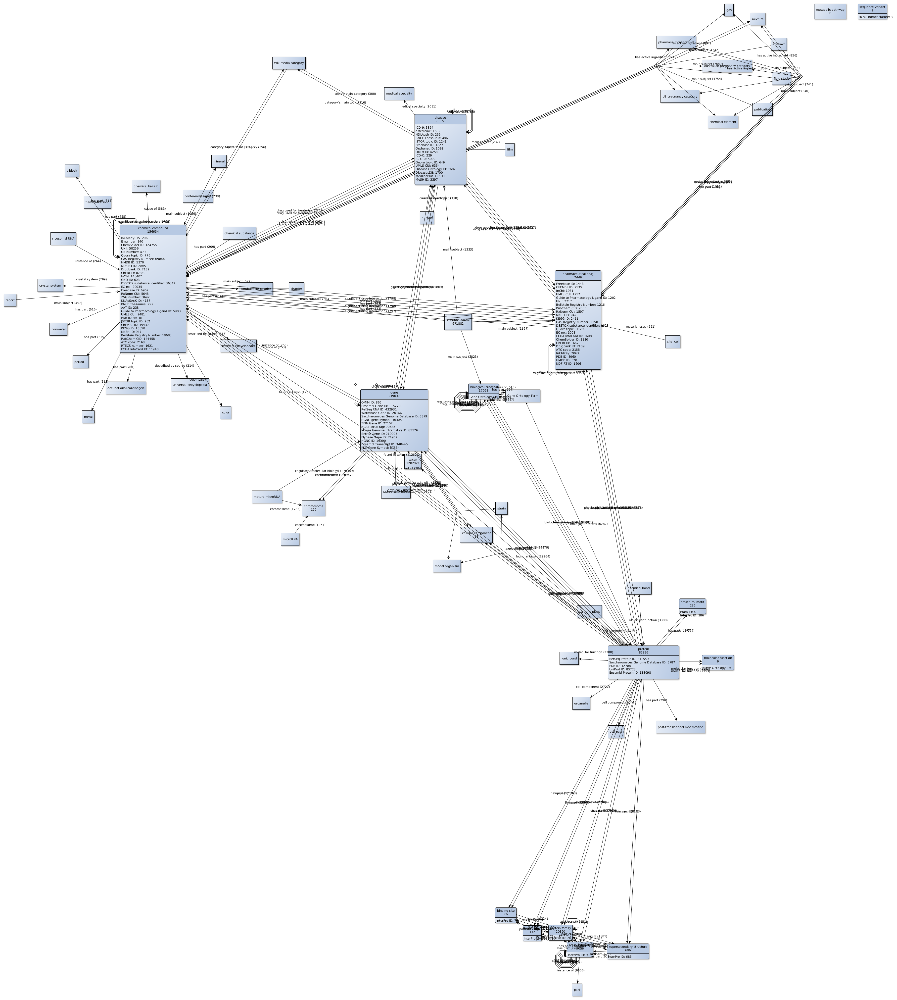

## Gene Wiki World
#### Generate a network of all items we care about, and some we don't....

### Usage
1. Run ```python3 get_counts.py```

2. Download & install [yEd](https://www.yworks.com/products/yed)

3. In yEd: "File -> Open" output of step 1

4. Edit -> Properties Manager -> Imports additional configurations: select "prop_mapper_config.cnfx"

5. Click "apply" for each the node and edge configurations

### Output

