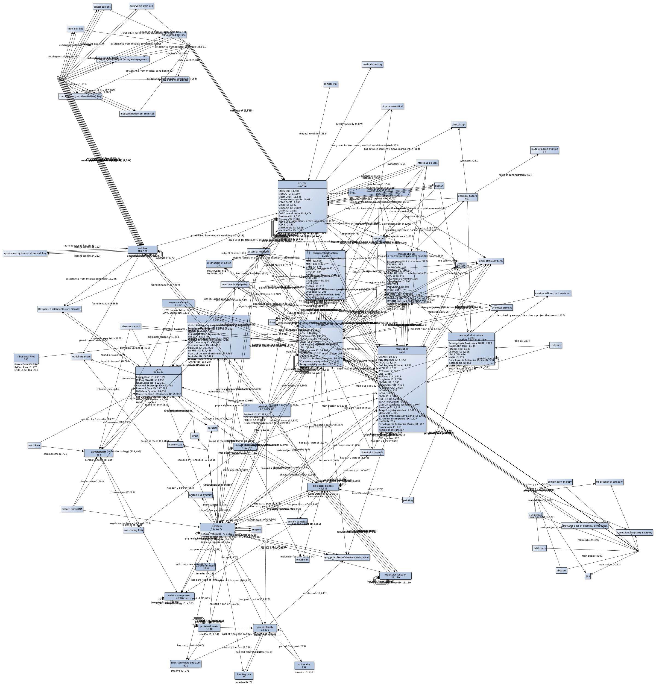
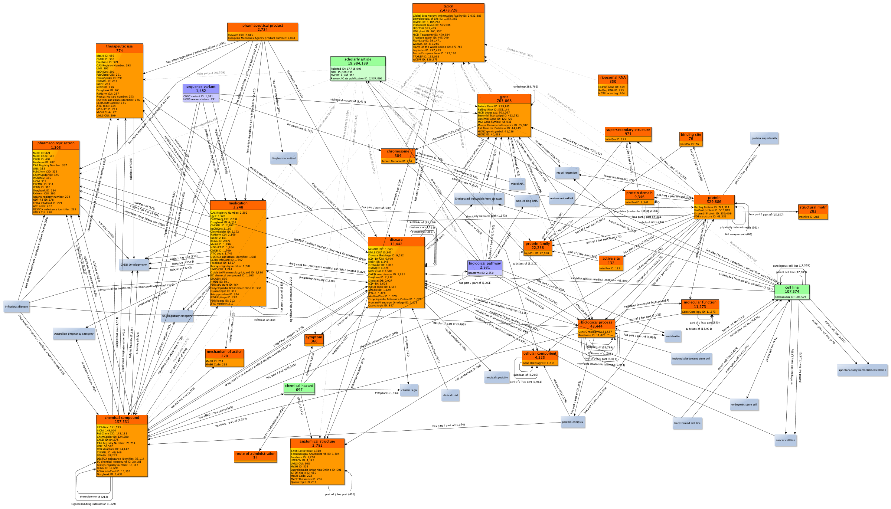
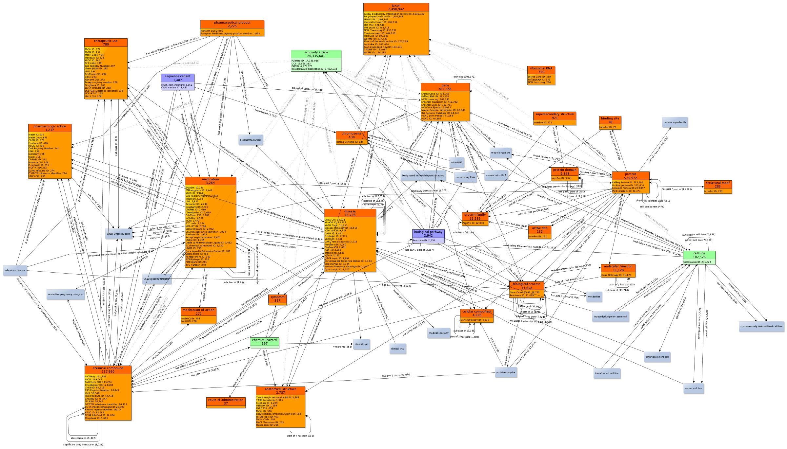

## Gene Wiki World
#### Generate a network of all items we care about, and some we don't....

## Search Mode

Search mode will take a set of seed node-types, count how many nodes are within that type,
find the type and number of external identifers attached to those nodes, and search outward
for other connected node types, returning both edge types and counts.

### Usage

1. Run ```python3 get_counts.py```

2. Download & install [yEd](https://www.yworks.com/products/yed)

3. In yEd: "File -> Open" output of step 1

4. Edit -> Properties Manager -> Imports additional configurations: select "prop_mapper_config.cnfx"

5. Click "apply" for each the node and edge configurations

### Output

Original output is messy and needs some manual editing


However, with editing in yEd, the following graph can be produced.


## Update Mode

Update mode will do an in-place update of all the counts of node-types, external identifiers,
and relationships between nodes. No new relationships will be added, however, all previous
manual edits to the graph shape and structure will remain intact.

### Usage

1. Run ```python3 update_graphml.py <inputfilename> <outputfilename>```

`inputfilename` should be an graphml file
output will be written to `outputfilename`.  If no `outputfilename` is specified, an autogenerated one will be created based on the `inputfilename`.

### Output



